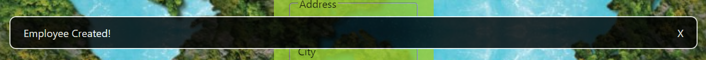

# Migration d'une application jQuery vers React


## Présentation



- repository : https://github.com/fodie94/PluginNpm.git

- package npm : https://www.npmjs.com/package/@fodieniakate/modalep14

## Installing the package

### 1/ Install package :

`npm i @fodieniakate/modalep14`

### 2/ Import the component from the library :

`import { Modale2 } from "@fodieniakate/modalep14";`

### 3/ Place this state hook (concerning the opening/closing of the modal) at the start of the function that uses the Modal component :

`const [isOpen, setIsOpen] = useState(false)`

### 4/ In the return of the function, call the Modal component with at least the `setIsOpen` and `text` props :

`{isOpen && <Modal setIsOpen={setIsOpen}  />}`

### 5/ Example :

```js
import React, { useState } from "react";
import { Modale2 } from "@fodieniakate/modalep14";

export default function Home() {
  const [isOpen, setIsOpen] = useState(false);

  return (
    <>
      <h1>Modal Test</h1>
      <button onClick={() => setIsOpen(true)}>Open Modal</button>
      {isOpen && <Modal setIsOpen={setIsOpen} />}
    </>
  );
}
```

## Prérequis


## Dépendances


